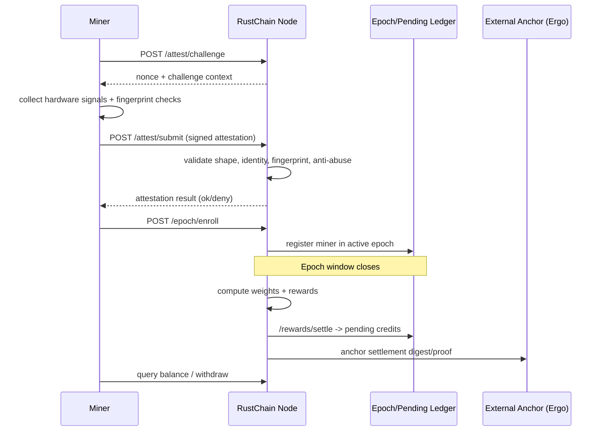

# RustChain Protocol Documentation (Bounty #8 Draft)

## 1) Protocol Overview

RustChain is a **Proof-of-Antiquity** blockchain (RIP-200) that rewards physical hardware identity over raw hash power.

- Consensus principle: **1 CPU = 1 vote**, then weighted by antiquity/fingerprint validity.
- Focus: reward real vintage hardware (PowerPC-era, retro architectures) and penalize VM/emulator spoofing.
- Runtime stack (current implementation): Flask + SQLite node, miner scripts for Linux/macOS, signed transfer + pending ledger settlement.

---

## 2) RIP-200 Consensus and Epoch Lifecycle

### 2.1 High-level flow



### 2.2 Epoch settlement

At settlement, miners in epoch are weighted by hardware/fingerprint/consensus rules and paid from epoch pool.

Conceptually:

```text
reward_i = epoch_pool * weight_i / sum(weight_all_eligible_miners)
```

---

## 3) Attestation Flow (what miner sends, what node validates)

## 3.1 Miner payload

Attestation payload contains (simplified):

- `miner` / `miner_id`
- `report` (nonce/commitment/derived timing entropy)
- `device` (family/arch/model/cpu/cores/memory/serial)
- `signals` (hostname/MAC list, etc.)
- `fingerprint` (results of checks)
- optional sidecar proof fields (if dual-mining mode enabled)

## 3.2 Node validation gates

Node-side validation includes:

1. **Shape validation** for request body/fields
2. **Miner identifier validation** (allowed chars/length)
3. **Challenge/nonce consistency**
4. **Hardware signal sanity checks**
5. **Rate limit / anti-abuse checks by client IP / miner**
6. **Fingerprint pass/fail classification**
7. **Enrollment eligibility decision**

If accepted, miner can call `/epoch/enroll` and participate in reward distribution.

---

## 4) Hardware Fingerprinting (6+1)

RustChain uses hardware-behavior checks to distinguish physical machines from VMs/emulators.

Primary checks (implementation naming varies by miner/tooling):

1. Clock-skew / oscillator drift
2. Cache timing characteristics
3. SIMD instruction identity/timing
4. Thermal drift entropy
5. Instruction-path jitter
6. Anti-emulation heuristics (hypervisor/container indicators)
7. (Optional hardening layer) serial/OUI consistency enforcement in node policies

Why it matters:

- prevents synthetic identity inflation
- keeps weight tied to **real** hardware behavior
- protects reward fairness across participants

---

## 5) Token Economics (RTC)

- Native token: **RTC**
- Reward source: epoch distribution + pending ledger confirmation paths
- Weight-driven payout: higher eligible weight gets larger epoch share
- Additional policy knobs exposed by endpoints (`/api/bounty-multiplier`, `/api/fee_pool`, etc.)

> Note: precise emissions, premine, and multiplier schedules should be versioned in canonical tokenomics docs; this file documents protocol mechanics + API surfaces.

---

## 6) Network Architecture

```mermaid
graph TD
  M1[Miner A] --> N[Attestation/Settlement Node]
  M2[Miner B] --> N
  M3[Miner C] --> N

  N --> P[(Pending Ledger / Epoch State)]
  N --> X[Explorer/UI APIs]
  N --> A[External Anchor (Ergo)]
```

Components:

- **Miners**: generate attestation reports + enroll each epoch
- **Node**: validates attestations, computes rewards, exposes APIs
- **Pending ledger**: tracks pending confirmations/void/integrity operations
- **Explorer/API**: status, balances, miners, stats
- **Anchor layer**: external timestamp/proof anchoring

---

## 7) Public API Reference (with curl examples)

Base example:

```bash
BASE="https://rustchain.org"
```

## 7.1 Health / status

### GET `/health`
```bash
curl -sS "$BASE/health"
```

### GET `/ready`
```bash
curl -sS "$BASE/ready"
```

### GET `/ops/readiness`
```bash
curl -sS "$BASE/ops/readiness"
```

## 7.2 Miner discovery / stats

### GET `/api/miners`
```bash
curl -sS "$BASE/api/miners"
```

### GET `/api/stats`
```bash
curl -sS "$BASE/api/stats"
```

### GET `/api/nodes`
```bash
curl -sS "$BASE/api/nodes"
```

## 7.3 Attestation + enrollment

### POST `/attest/challenge`
```bash
curl -sS -X POST "$BASE/attest/challenge" -H 'Content-Type: application/json' -d '{}'
```

### POST `/attest/submit`
```bash
curl -sS -X POST "$BASE/attest/submit" \
  -H 'Content-Type: application/json' \
  -d '{"miner":"RTC_example","report":{"nonce":"n"},"device":{},"signals":{},"fingerprint":{}}'
```

### POST `/epoch/enroll`
```bash
curl -sS -X POST "$BASE/epoch/enroll" \
  -H 'Content-Type: application/json' \
  -d '{"miner_pubkey":"RTC_example","miner_id":"host-1","device":{"family":"x86","arch":"modern"}}'
```

### GET `/epoch`
```bash
curl -sS "$BASE/epoch"
```

## 7.4 Wallet / balances / transfer

### GET `/balance/<miner_pk>`
```bash
curl -sS "$BASE/balance/RTC_example"
```

### GET `/wallet/balance?miner_id=<id>`
```bash
curl -sS "$BASE/wallet/balance?miner_id=RTC_example"
```

### POST `/wallet/transfer`
```bash
curl -sS -X POST "$BASE/wallet/transfer" \
  -H 'Content-Type: application/json' \
  -d '{"from":"RTC_a","to":"RTC_b","amount":1.25}'
```

### POST `/wallet/transfer/signed`
```bash
curl -sS -X POST "$BASE/wallet/transfer/signed" \
  -H 'Content-Type: application/json' \
  -d '{"from":"RTC_a","to":"RTC_b","amount":1.25,"signature":"...","pubkey":"..."}'
```

### GET `/wallet/ledger`
```bash
curl -sS "$BASE/wallet/ledger"
```

## 7.5 Pending ledger ops

### GET `/pending/list`
```bash
curl -sS "$BASE/pending/list"
```

### POST `/pending/confirm`
```bash
curl -sS -X POST "$BASE/pending/confirm" -H 'Content-Type: application/json' -d '{"id":123}'
```

### POST `/pending/void`
```bash
curl -sS -X POST "$BASE/pending/void" -H 'Content-Type: application/json' -d '{"id":123,"reason":"invalid"}'
```

### GET `/pending/integrity`
```bash
curl -sS "$BASE/pending/integrity"
```

## 7.6 Rewards + mining economics

### GET `/rewards/epoch/<epoch>`
```bash
curl -sS "$BASE/rewards/epoch/1"
```

### POST `/rewards/settle`
```bash
curl -sS -X POST "$BASE/rewards/settle" -H 'Content-Type: application/json' -d '{}'
```

### GET `/api/bounty-multiplier`
```bash
curl -sS "$BASE/api/bounty-multiplier"
```

### GET `/api/fee_pool`
```bash
curl -sS "$BASE/api/fee_pool"
```

## 7.7 Explorer + machine details

### GET `/explorer`
```bash
curl -sS "$BASE/explorer" | head
```

### GET `/api/miner/<miner_id>/attestations`
```bash
curl -sS "$BASE/api/miner/RTC_example/attestations"
```

### GET `/api/miner_dashboard/<miner_id>`
```bash
curl -sS "$BASE/api/miner_dashboard/RTC_example"
```

## 7.8 P2P / beacon / headers (operator-facing public routes)

- `POST /p2p/add_peer`
- `GET /p2p/blocks`
- `GET /p2p/ping`
- `GET /p2p/stats`
- `GET/POST /beacon/*` (`/beacon/digest`, `/beacon/envelopes`, `/beacon/submit`)
- `POST /headers/ingest_signed`, `GET /headers/tip`

---

## 8) Operator/Admin API groups

These are exposed routes but typically for controlled operator use:

- OUI enforcement/admin:
  - `/admin/oui_deny/list|add|remove|enforce`
  - `/ops/oui/enforce`
- Governance rotation:
  - `/gov/rotate/stage|commit|approve|message/<epoch>`
- Metrics:
  - `/metrics`, `/metrics_mac`
- Withdraw flows:
  - `/withdraw/register|request|status/<id>|history/<miner_pk>`

---

## 9) Security Model Notes

- Trust boundary: client payload is untrusted; server performs strict type/shape checks.
- Identity hardening: IP-based anti-abuse + hardware fingerprinting + serial/OUI controls.
- Transfer hardening: signed transfer endpoint for stronger authorization path.
- Settlement auditability: pending ledger + integrity endpoints + external anchoring.

---

## 10) Glossary

- **RIP-200**: RustChain Iterative Protocol v200; Proof-of-Antiquity consensus design.
- **Proof-of-Antiquity**: consensus weighting emphasizing vintage/real hardware identity.
- **Epoch**: reward accounting window; miners enroll and settle per epoch.
- **Attestation**: miner proof packet (hardware signals + report + fingerprint).
- **Fingerprint checks (6+1)**: anti-VM/emulation hardware-behavior tests plus policy hardening layer.
- **Pending ledger**: intermediate transfer/reward state before final confirmation/void.
- **PSE / entropy-derived signals**: timing/noise signatures used in report/fingerprint scoring.
- **Anchoring**: writing settlement proof to external chain (Ergo).

---

## 11) Suggested docs split for final upstream submission

To match bounty acceptance cleanly, split this into:

- `docs/protocol/overview.md`
- `docs/protocol/attestation.md`
- `docs/protocol/epoch_settlement.md`
- `docs/protocol/tokenomics.md`
- `docs/protocol/network_architecture.md`
- `docs/protocol/api_reference.md`
- `docs/protocol/glossary.md`

This draft is intentionally consolidated for review-first iteration.
